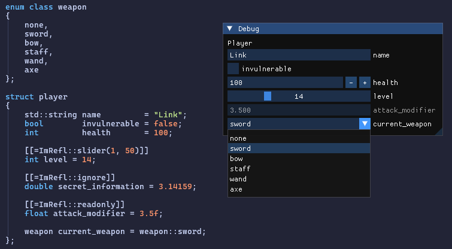

# ImRefl - A C++26 reflection library for ImGui

A header-only library utilising C++26 reflection features to generate ImGui rendering code at compile time for structs without the need for macro magic or additional boilerplate.



Simply include the header, declare your types and call `ImRefl::Input`:

```cpp
player main_player = {};
ImGui::Begin("Debug");
ImRefl::Input("Player", main_player);
ImGui::End();
```

That's it! No macros or other setup needed!

## Features
### Supported types
#### `imrefl.hpp`
* Aggregate structs.
* All enumeration types (both C-style `num` and C++ scoped `enum class`).
* All arithmetic types.
    * `bool` is rendered as a checkbox.
    * `char` is treated as a character rather than an 8 bit integer. 
    * `long double` is treated as a `double` as it is not supported by ImGui out of the box.
* `T*`.
    * Shows the pointed-at value (or <nullptr>").
    * The value can be changed, but the pointer cannot be reassigned.
* `T[N]` (C-style arrays).
* `std::array<T, N>`.
* `std::span<T>`.
* `std::string`.
* `std::string_view`.
* `std::pair<L, R>`.
* `std::tuple<Ts...>`.
* `std::optional<T>`.
    * Displays the inner value or "<nullopt>".
    * If `T` is default initializable, the optional can also be disengaged and reengaged.
* `std::variant<Ts...>`.
    * Displays the inner value.
    * Only allows for changing the contained type if all inner types are default initializable.
* All containers satisfying `std::ranges::forward_range`, notably:
    * `std::vector<T>`.
    * `std::deque<T>`.
    * `std::list<T>`.
    * `std::forward_list<T>`.
    * `std::set<T>`.
    * `std::unordered_set<T>`.
    * `std::multiset<T>`.
    * `std::unordered_multiset<T>`.
    * `std::map<K, V>`.
    * `std::unordered_map<K, V>`.
    * `std::multimap<K, V>`.
    * `std::unordered_multimap<K, V>`.
    * `std::inplace_vector<T, N>`.
    * `std::flat_map<K, V>`.
    * `std::flat_set<T>`.
    * `std::flat_multimap<K, V>`.
    * `std::flat_multiset<T>`.
    * Supports `push_back`, `pop_back`, `push_front`, `pop_front`, `emplace` and `erase` when appropriate.
* `std::unique_ptr<T>`, `std::shared_ptr<T>`, `std::weak_ptr<T>`.
    * Acts the same as `T*`.
* `std::indirect<T>`.
* `std::function<Return()>`
    * Rendered as a button. Pressing the button calls the function.
    * The return value of type `Return` is discarded.
* `std::bitset<N>`.
* `std::source_location`.
    * This is always read-only.
* `std::complex<T>`.
* `std::expected<T, E>`.
* Partial `std::chrono` support:
    * `std::chrono::time_point<Clock, Duration>`.
    * `std::chrono::duration<Rep, Period>`.
    * `std::chrono::year_month_day`.
    * `std::chrono::hh_mm_ss<Duration>`.

#### `imrefl_glm.hpp`
* All vector types from the GLM graphics library, e.g. `glm::vec2` and `glm::ivec3`.

### Annotations

| Annotation                 | Description                         |
|----------------------------|-------------------------------------|
| `ImRefl::ignore`           | Skips the data member when rendering the widget. |
| `ImRefl::readonly`         | Shows the field on the widget but makes it non-interactable. |
| `ImRefl::normal`           | Sets the visual style of arithmetic types (and arrays of) to a standard input box. This is the default option, but this is provided for consistency. |
| `ImRefl::slider(min, max)` | Changes the visual style of arithmetic types (and arrays of) to a slider with the given limits. |
| `ImRefl::drag(min, max, speed=1.0f)` | Changes the visual style of arithmetic types (and arrays of) to a dragger with the given limits and speed. |
| `ImRefl::color`            | Renders the annotated field as a color picker. Works for 3 and 4 dimensional arrays and spans as well as `glm::vec3` and `glm::vec4`. |
| `ImRefl::color_wheel`      | Similar to the above but a full color wheel. |
| `ImRefl::string` | For C-style char arrays, formats them as a fixed size string rather than a set of values. |
| `ImRefl::radio` | For enum classes. Displays the enum as a series of radio buttons rather than a dropdown. |
| `ImRefl::in_line` | By default, array-like values are show with each element on a separate line. However, for types such as `float[3]` representing a position, it may be desirable to show them on a single line, which this annotation is for. |
| `ImRefl::non_resizeable` | For dynamic arrays, this annotation disables the ability to add and remove elements. |
| `ImRefl::separator(title)` | Adds an ImGui separator line with optional title above the annotated field. |
| `ImRefl::begin_region(title)` | Adds a collapsible region within an aggregate. |
| `ImRefl::end_region(levels)` | Closes a collapsible region; defaults to 1 level, 0 is used to close all nested regions in the stack. | 

### Third-party types
It is possible to implement the rendering logic for custom types by providing an implementation of `ImRefl::Renderer` for your type. For example:

```cpp
class custom_type
{
    int data;
public:
    custom_type(int d) : data{d} {}
    int get() const { return data; }
    void set(int d) { data = d; }
};

template <ImRefl::Config config>
struct ImRefl::Renderer<config, custom_type>
{
    static bool Render(const char* name, custom_type& type)
    {
        int inner = value.get();
        if (Input<config>(name, inner)) { // delegate back to Input
            value.set(inner);
            return true;
        }
        return false;
    }

    static bool Render(const char* name, const custom_type& type)
    {
        return ImRefl::DelegateToNonConst<config>(name, value);
    }
};
```

There are a few key things to point out:

* Implementations of `Renderer` take a `ImRefl::Config` non-type template parameter. This is the mechanism for passing annotation data around; if a struct contains a data member of this type and it is annotated, then these annotations are accessible through the config. This means that third-party types can make use of the given `ImRefl` annotations as well as allowing users to define their own.
* These functions should return `bool`, indicating if the given value has changed. The non-`const` version thus should always return false.
* You can delegate to `ImRefl::Input` for other types.
* Implementing two versions of the `Render` function can be tedious, and if your type is small and cheap to copy, you may want to implement the `const` version by simply taking a mutable copy and calling the non-`const` version. For that `ImRefl` provides the helper function `DelegateToNonConst` to do exactly this.

### External annotations
Sometimes it is not possible to modify a struct definition to add annotations. In this case, you can define a template specialization of `ImRefl::ExternalAnnotations<T>` for your struct `T` and add fields with annotations there. The type of these fields does not matter; only the name of the field.

```cpp
struct player
{
    int level = 14;
};

template <>
struct ImRefl::ExternalAnnotations<player>
{
    [[=ImRefl::slider(1, 50)]]
    void* level;
};
```

### Helper functions
This section is still a work in progress as we work out which functionality is useful to expose to users.

* `TreeNodeExNoDisable` - this is a wrapper function for `ImGui::TreeNodeEx`. This is useful for creating a tree node that is still expandable/collapsible when in read-only mode.
* `DelegateToNonConst` - a helper function for implementing a `const&` render function by calling the `&` version (by making a temporary copy). See the third-party example above.

## Building the example
### Dependencies
- glfw3

From the top level of the repository, run:
```
cmake -S . -B build -DIMREFL_BUILD_EXAMPLE=ON -DCMAKE_CXX_COMPILER=/path/to/cxx26/compiler && cmake --build build
```
replacing `/path/to/cxx/compiler` with the path to your compiler. This will produce a binary at `build/example/imrefl-example`


## Importing the library
Using `ImRefl` in your own project is simple using CMake:
```cmake
# First include the source directory:
add_subdirectory(imrefl)

# OR with FetchContent:
include(FetchContent)
FetchContent_Declare(
    imrefl
    GIT_REPOSITORY https://github.com/wangyan98/StartNode.git
)
FetchContent_MakeAvailable(imrefl)

# Then link the ImRefl interface
target_link_libraries(example PRIVATE ImRefl)
```

## Future work
* All reasonable standard library types (for some definition of reasonable).
* More annotations for other ImGui visual styles and customisation points.
* Properly document all supported types and customization points.
* Use of existing annotations on supported types that make sense.
